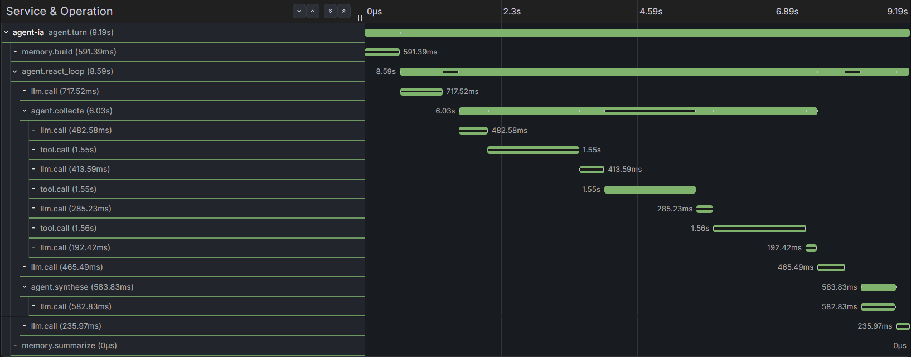
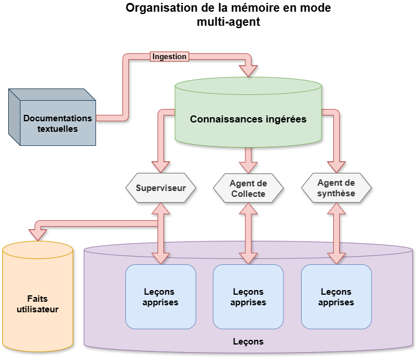
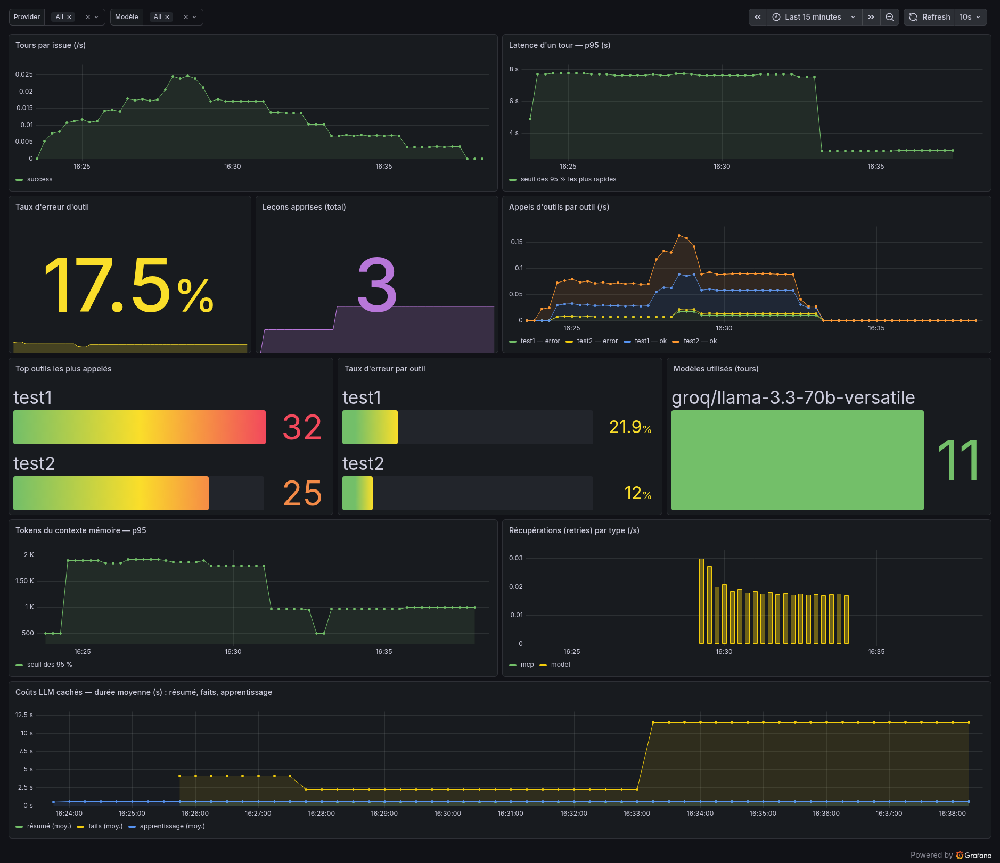

## Contexte et objectif

Je voyais les modèles de langage comme de simples assistants conversationnels, et j'avais du
mal à imaginer leur intégration dans de vrais projets techniques. J'ai commencé par explorer
des outils existants, Cline et Aider, en combinant des tests locaux sur ma machine avec les
offres gratuites d'OpenRouter : le cloud pour les tâches de réflexion complexes, le local pour
les micro-tâches du quotidien comme la génération automatique de messages de commit.

Utiliser ces outils ne m'a pas suffi longtemps : je voulais comprendre l'architecture qu'il y a
derrière. Le livre *Concevoir des applications avec des agents IA* de Michael Albada
(First/O'Reilly) m'a donné les bases pour concevoir le mien. Il m'a ouvert des pistes et fait
découvrir des concepts que je ne connaissais pas ; l'approfondissement, les technologies
retenues et les partis pris d'implémentation sont les miens.

Ce projet est le seul de cette série qui ne relève pas de l'administration systèmes, et c'est
délibéré. Les questions qu'il pose sont les mêmes : que se passe-t-il réellement à l'intérieur,
combien ça coûte, et comment le mesurer plutôt que de le supposer.

## Architecture

Un fonctionnement distribué : mon PC principal exécute l'agent, mon Raspberry Pi héberge un
serveur MCP contenant mes outils personnalisés.

| Composant | Rôle |
|---|---|
| Agent Python | Boucle de raisonnement, appel d'outils, orchestration |
| Serveur MCP | Expose les outils, hébergé sur le Raspberry Pi |
| Interface TUI | Rich et prompt-toolkit, commandes slash, mode debug |
| Mémoire courte | Résumé glissant de la conversation, recompacté au-delà d'un seuil |
| Mémoire longue | Faits atomiques extraits par le modèle, vectorisés dans ChromaDB |
| RAG de connaissances | Documentation, en lecture seule, séparée des données utilisateur |
| OpenTelemetry → Prometheus / Tempo | Métriques et traces |
| Grafana | Tableaux de bord et lecture des traces |
{: .tableau-machines }

Le système est finalement devenu multi-agents : un **superviseur** qui ne répond jamais
lui-même mais délègue, un agent de **collecte** qui va chercher l'information via les outils, et
un agent de **synthèse** qui met en forme la réponse finale.

## Choix techniques

**Le dual brain, résumé court terme et faits vectorisés.** Au début je sauvegardais tout
l'historique brut ; plus la conversation grandissait, plus chaque tour coûtait cher en jetons.
D'où l'approche « dual brain » : un résumé glissant à court terme, des faits atomiques
vectorisés à long terme, récupérés par similarité. Ce n'est pas un RAG qui réinjecte des
documents source, mais un pipeline où un modèle résume la conversation et en extrait ce qui
mérite d'être retenu.

**L'apprentissage non paramétrique, sans modifier le modèle.** Mon agent savait déjà se corriger : un outil
échoue, il voit l'erreur, il retente. Le problème : à la requête suivante, même outil, même
piège, il refaisait exactement la même erreur. J'ai mis en pratique un apprentissage dit non
paramétrique : quand un outil échoue puis se corrige, l'agent en tire une leçon, qui part dans
une base vectorielle partagée par toutes les sessions et revient dans le contexte à une demande
similaire. Je n'ai pas rendu le modèle plus malin, j'ai posé son expérience à côté de lui, et
je peux ouvrir ses leçons, en corriger une, en supprimer une mauvaise.

**L'observabilité peut être coupée sans rien casser.** Désactivée, l'agent tourne sans aucune
dépendance. Activée, il pousse ses métriques en OTLP vers une autre machine, sans même savoir
qu'il est observé.

**Le choix d'un TUI, inspiré d'Aider.** Il m'a contraint à
structurer le code dès le départ pour pouvoir brancher d'autres interfaces plus tard. J'y ai
découvert le patron Registry : chaque commande s'enregistre par un décorateur, ce qui rend
l'ajout d'une commande trivial.

**Une mémoire cloisonnée entre agents.** Trop partager pollue chaque agent avec du bruit qui ne
le concerne pas ; trop isoler lui fait ignorer la documentation commune. J'ai tranché ainsi :
les connaissances ingérées sont communes à tous, les leçons apprises sont cloisonnées par rôle,
et les faits utilisateur ne sont portés que par le superviseur.

## Difficulté rencontrée

**Une authentification MCP qui semblait cassée.** J'avais mis en place une authentification par
identifiant et jeton côté serveur MCP, sans réussir à confirmer que le client envoyait les bons
en-têtes. J'ai fini par instrumenter `httpx` à la volée pour inspecter les paquets en direct,
pour découvrir que le serveur recevait bel et bien les en-têtes, mais filtrait lui-même les
champs sensibles comme `Authorization` dans ses propres journaux. Le problème n'existait pas :
c'est la journalisation qui me le cachait.

**Deux constats que le ressenti avait manqués.** J'évaluais l'agent au
ressenti : « ça a l'air rapide », « il se trompe rarement ». Une fois instrumenté, deux
constats ont renversé mes priorités.

Le premier vient des métriques. Parmi les appels de modèle invisibles à l'écran (le résumé,
l'extraction de faits, l'apprentissage), ce n'est pas le résumé qui coûte cher, mais
l'extraction de faits, à plus de dix secondes. Sans ce graphe, j'aurais optimisé au mauvais
endroit.

Le second vient des traces, une fois chaque tour décomposé en étapes : sur un premier appel, le
total montait à 1 635 jetons alors que mon contexte mémoire n'en pesait que 165. Les quatre-
vingt-dix pour cent restants étaient le prompt système et les définitions d'outils. Là encore,
j'aurais passé du temps à optimiser la mémoire alors que la consommation réelle était ailleurs.

Ces deux erreurs de diagnostic évitées sont, pour moi, ce que ce projet m'a le plus appris : sans
les métriques et les traces, j'aurais optimisé le résumé et la mémoire, pas l'extraction de faits
ni le prompt système, qui coûtaient réellement le plus cher.

## Bilan

Sept étapes, d'un agent capable d'appeler un outil distant jusqu'à un système multi-agents
instrumenté de bout en bout :

- **Fondations** : appel d'outils distants via le protocole MCP.
- **Interface** : TUI avec commandes slash, mode debug, bascule entre OpenRouter, OpenAI et
  Ollama, reprise automatique si un outil tombe.
- **Mémoire** : dual brain, faits isolés par session et dédoublonnés sémantiquement, résumé
  déclenché selon le volume de jetons, RAG de documentation séparé.
- **Apprentissage** : leçons tirées de chaque échec d'outil, partagées entre sessions,
  inspectables et purgeables ; la réflexion ne se déclenche que sur erreur, ce qui borne son
  coût.
- **Métriques** : latence, taux d'erreur par outil, jetons de mémoire, coûts cachés, le tout
  étiqueté par fournisseur et par modèle : comparer deux modèles devient une lecture de courbes
  et non un débat d'intuitions.
- **Traces** : chaque requête décomposée étape par étape, du contexte mémoire à l'appel d'outil
  en erreur et à sa correction.
- **Multi-agents** : un superviseur, un agent de collecte, un agent de synthèse, chacun avec sa
  mémoire cloisonnée et ses propres leçons.

Le dépôt contient l'agent complet, le serveur d'outils MCP, la pile d'observabilité qui se lance
en une commande, et une documentation d'architecture qui détaille les choix de conception autant
que le code.

C'est un projet d'apprentissage, pas un produit fini, et il est documenté comme tel : le README
expose les partis pris, le rôle de l'IA dans le développement, les limites connues et ce qui
reste à améliorer.
