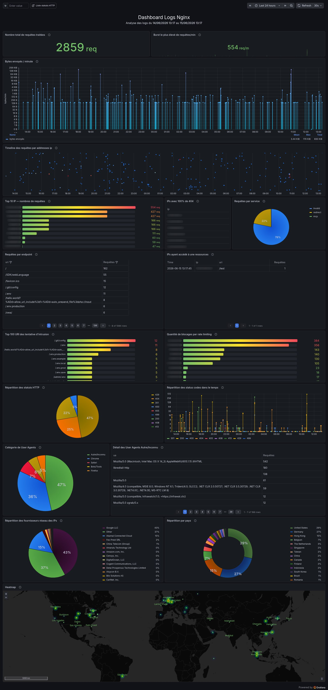
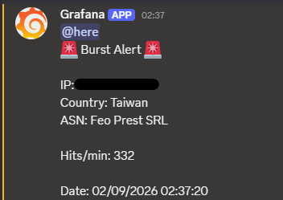
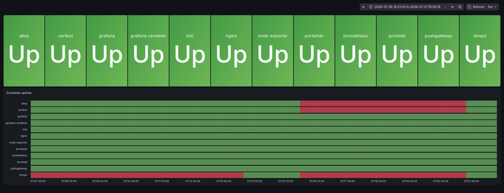

## Contexte et objectif

J'ai commencé ce homelab en parallèle de mes études, pour mettre directement en application ce
que j'apprenais, et surtout pour apprendre des choses que le programme ne couvrait pas.

Il est vite devenu le seul endroit où je subis les conséquences de mes propres décisions
d'exploitation dans la durée : un service qui tombe, un certificat qui expire, une machine qui
redémarre sans que tout revienne. C'est ce qui en fait un terrain d'apprentissage différent
d'un travail pratique, où l'environnement est remis à zéro à la fin.

## Architecture

| Composant | Rôle |
|---|---|
| Ubuntu Server | Machine hôte du homelab |
| Docker et Portainer | Conteneurisation des services, inspection quotidienne |
| Nginx | Reverse proxy en frontal, terminaison TLS |
| Certbot | Renouvellement automatique des certificats |
| Prometheus | Métriques système et applicatives |
| Loki et Promtail | Collecte et indexation des journaux |
| Grafana | Tableaux de bord et alertes |
| OpenVPN | Accès distant au réseau du lab |
| SSH | Administration de la machine |
{: .tableau-machines }

## Choix techniques

**Tout migrer vers Docker, après avoir commencé à la main.** J'ai d'abord installé Nginx et
Certbot directement sur la machine, pour exposer mes applications vers l'extérieur avec Nginx
en reverse proxy. J'y ai ajouté un VPN OpenVPN afin de tester mes applications sur mon réseau
quand j'étais en déplacement, en me connectant en SSH.

C'est la maintenance qui m'a fait changer d'approche : à mesure que les services s'accumulaient,
tenir cette installation à jour devenait compliqué. J'ai donc tout migré vers Docker, en
commençant par Nginx et Certbot, puis j'ai ajouté Portainer pour gérer mes conteneurs, et enfin
d'autres services, notamment de supervision.

**Les journaux Nginx, enrichis et visualisés dans Grafana.** L'idée de la supervision est venue
en regardant le volume de requêtes que je recevais. Je voulais les analyser de façon plus
visuelle, donc je les ai enrichis avant de les y envoyer.

Ça passe par Promtail, qui ne se contente pas de collecter les journaux depuis les conteneurs
Docker : il fait un parsing JSON, une résolution GeoIP via GeoLite2 City (ville, pays,
coordonnées) et une résolution ASN pour le fournisseur réseau. J'ai configuré Nginx pour émettre
ses journaux directement en JSON structuré, pour que Grafana construise ses visualisations
directement dessus.

En analysant les requêtes, le constat a été
immédiat : beaucoup de robots scannent le serveur, et sur des points d'entrée très variés. Le
tableau de bord fait ressortir des tentatives répétées sur des chemins caractéristiques comme
`/.git/config`, `/.env` et toutes ses variantes, `/owa/` ou encore `/SDK/webLanguage`, avec des
agents utilisateurs d'outils de scan automatisés.

Sur une journée type, cela représente 2859 requêtes, avec un pic à 554 requêtes par minute. La
limitation de débit absorbe à elle seule 47 % du trafic en réponses HTTP 429 : le filtrage stoppe
net une bonne partie des tentatives avant qu'elles n'aillent plus loin. Le trafic se concentre sur
quelques origines, 43 % passant par les centres de données de Google LLC, et deux pays dominent le
classement, les États-Unis et l'Allemagne, à eux deux plus de la moitié des requêtes.

Sur ce même flux, j'ai aussi testé le système d'alertes de
Grafana en me faisant avertir à chaque pic de cent requêtes par minute. La notification part sur
Discord, qui me prévient sur l'ordinateur comme sur le téléphone, avec l'adresse IP concernée,
sa localisation et son fournisseur.

**Une sauvegarde quotidienne des configurations, versionnée.** Les fichiers de configuration de
mes services sont sauvegardés chaque nuit par une tâche planifiée : un script Bash les
synchronise en local avec `rsync`, puis les pousse dans un dépôt Git privé. Versionner plutôt
que copier change la nature de la sauvegarde : je ne récupère pas seulement le dernier état,
je vois ce qui a changé et quand.

**Un tableau de bord pour l'état de santé des conteneurs.** À côté des métriques système et des
journaux, je voulais un signal simple : est-ce que chaque service tourne, oui ou non. Ce tableau
de bord affiche l'état de chaque conteneur et son historique de disponibilité dans le temps.

## Difficulté rencontrée

**Un service éteint, sans la moindre erreur.** Ce tableau de bord m'a permis de résoudre une
panne qui n'apparaissait nulle part dans les journaux : un service était simplement arrêté, sans
message d'erreur.

En croisant les informations, j'ai pu faire le lien avec un facteur extérieur qui avait provoqué
l'extinction de la machine. Les conteneurs ne s'étaient pas rallumés au redémarrage du homelab,
à cause d'un oubli dans leur configuration, que j'ai corrigé.

Ce que j'en retiens : sans la vue d'ensemble de l'état des conteneurs, je n'aurais eu aucun
signal, seulement un service silencieusement absent.

**Loki n'indexe pas le corps des journaux.** Contrairement à une base de données classique, il
n'indexe que les labels explicitement renseignés. Corréler les données efficacement impose donc
de bons compromis dès la conception : décider à l'avance quels champs deviennent des labels.

## Bilan

- Infrastructure conteneurisée : retour arrière possible sur chaque service, dépendances isolées.
- Certificats TLS renouvelés automatiquement, plus aucune expiration subie.
- Journaux centralisés et interrogeables, enrichis pour être analysables et non seulement lisibles.
- Alerte fonctionnelle de bout en bout, jusqu'à la notification sur le téléphone.
- Une panne réelle diagnostiquée grâce à la supervision, et sa cause corrigée.
- Configurations sauvegardées et versionnées chaque nuit.

Cette pile de supervision ne sert plus seulement au homelab : je l'ai réutilisée telle quelle
sur mes autres projets, mon agent IA et mon lab Windows/Linux, qui remontent leurs métriques
vers ce même Grafana.

**La suite.** Reprendre le VPN au propre, cette fois avec WireGuard. Monter un serveur DNS pour
filtrer certains sites. Continuer à construire des tableaux de bord pour élargir ce que je peux
surveiller et analyser. Et, pour aller plus loin sur les scans que j'observe, monter des points
d'entrée fictifs comme `/admin` ou une variante de `/.env`, qui journalisent tout ce qui les
touche : de quoi profiler les scanners.
