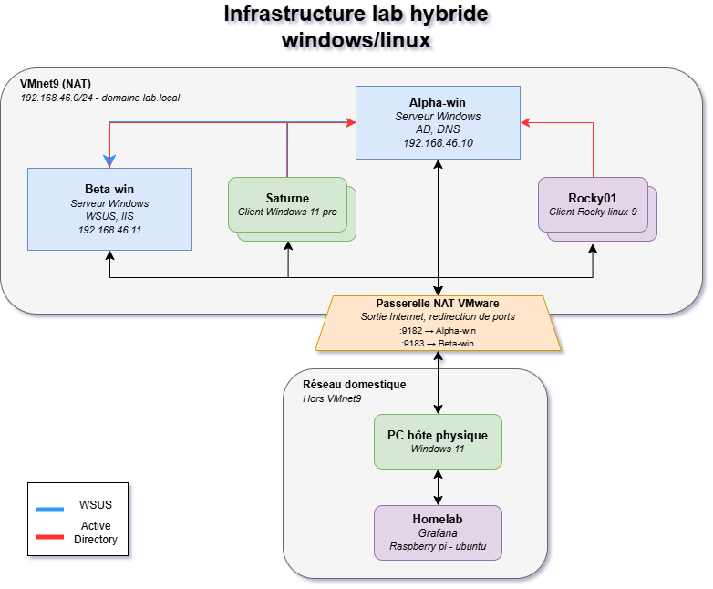
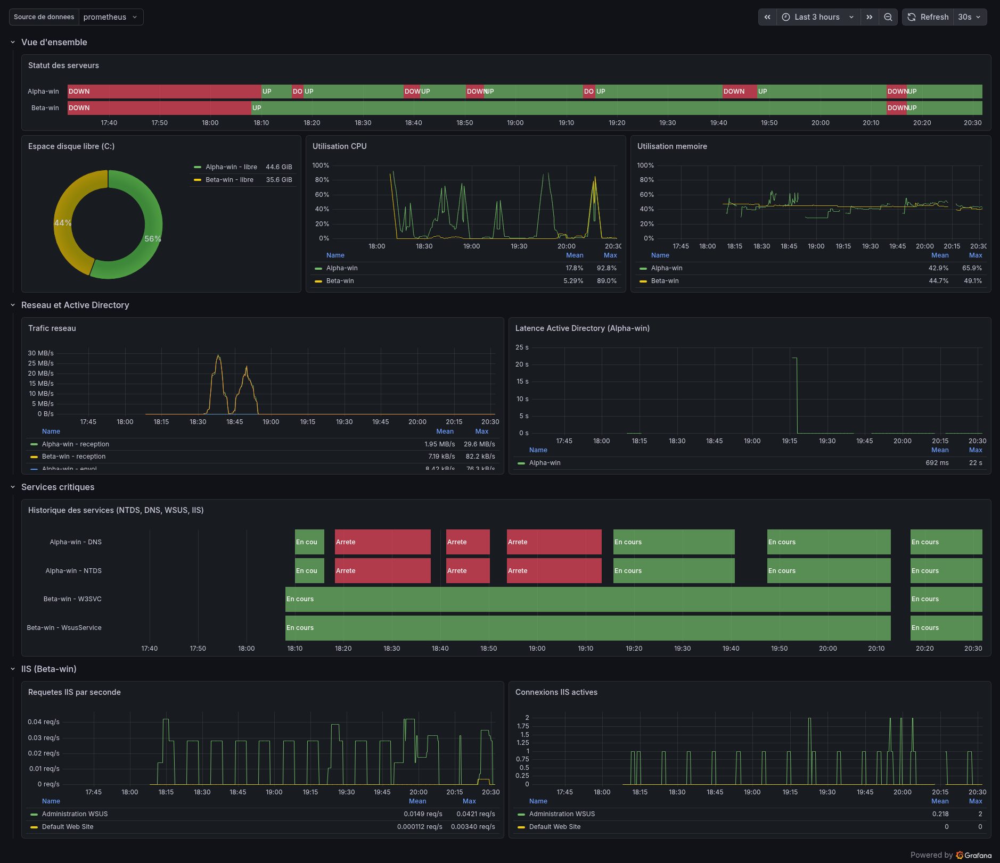
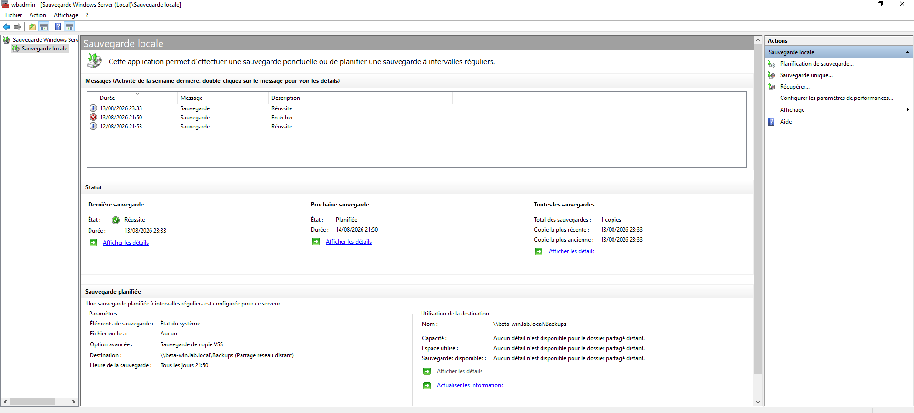

## Contexte et objectif

Mon homelab était jusque-là entièrement Linux : Docker, Nginx, supervision. De bonnes bases,
mais un angle mort complet sur l'écosystème Microsoft, alors qu'il revient presque à chaque
fois dans les annonces d'administrateur systèmes que je regarde.

Plutôt que de combler ce manque sur le papier, j'ai monté un lab complet de zéro : un
contrôleur de domaine Active Directory et un environnement hybride Windows/Linux, en machines
virtuelles. L'objectif n'était pas de faire tourner un domaine, mais d'aller jusqu'aux
opérations qu'on ne fait qu'en production : superviser, sauvegarder, et surtout restaurer.

## Architecture

Un réseau isolé `VMnet9` en NAT sous VMware, en `192.168.46.0/24`, portant le domaine
`lab.local`. Une passerelle le relie à mon réseau domestique, où tourne déjà mon homelab Linux.

| Machine | Rôle | Système | Adresse |
|---|---|---|---|
| Alpha-win | Contrôleur de domaine : AD DS, DNS intégré | Windows Server 2022 | 192.168.46.10 |
| Beta-win | Serveur membre : WSUS, IIS, administré sans interface graphique | Windows Server 2022 Core | 192.168.46.11 |
| Saturne | Poste client joint au domaine | Windows 11 Pro | DHCP |
| Rocky01 | Poste Linux joint au domaine | Rocky Linux 9 | DHCP |
| Homelab | Prometheus et Grafana, hors du lab | Raspberry Pi sous Ubuntu | Réseau domestique |
{: .tableau-machines }

L'annuaire est découpé en unités d'organisation par service (IT, Comptabilité, Direction) avec
des groupes de sécurité dédiés : les droits sont donnés à un groupe, jamais à une personne. Un
partage de fichiers unique, dont les droits sont gérés en NTFS plutôt que dupliqués sur les
autorisations de partage, et une stratégie de groupe qui mappe automatiquement un lecteur
réseau selon le service de l'utilisateur.

## Choix techniques

**Beta-win en Windows Server Core, sans interface graphique.** Tout s'y pilote depuis
Alpha-win, en PowerShell distant ou via Server Manager. C'était volontaire : je voulais
pratiquer les deux façons d'administrer plutôt que de rester sur celle qui rassure.

**WSUS pour centraliser les mises à jour** du domaine, plutôt que de laisser chaque poste
interroger directement les serveurs Microsoft.

**IIS en reverse proxy vers des applications Python.** La documentation Microsoft
recommande HttpPlatformHandler pour héberger du Python derrière IIS, mais son installateur
officiel renvoie une erreur 404, et l'alternative, wfastcgi, est officiellement non maintenue.
J'ai donc repris l'architecture que j'utilise déjà avec Nginx sur mon homelab : IIS en reverse
proxy vers des applications Python autonomes, lancées par une tâche planifiée au démarrage.

Deux applications isolées, une par service, avec authentification Windows intégrée bloquant
l'accès anonyme et restriction par groupe AD au niveau NTFS. C'est exactement le même modèle de
sécurité que sur le partage de fichiers, appliqué cette fois à une application web.

**L'application IT interroge WSUS en direct.** Je voulais voir concrètement comment faire
interagir Python avec le système Windows. L'application « IT » interroge WSUS via PowerShell
lancé en sous-processus, et affiche le statut des postes enregistrés.

**Un compte de service dédié par usage, à privilèges minimaux** : montage Linux, applications
Python. L'objectif est de limiter les dégâts en cas de faille découverte ailleurs.

**Supervision intégrée à mon homelab existant.** windows_exporter sur les deux serveurs
Windows, métriques remontées vers le Prometheus et le Grafana du Raspberry Pi. La difficulté ne
venait pas de l'exporteur mais du chemin réseau : les machines virtuelles étant sur un réseau
NAT isolé, il a fallu configurer une redirection de port explicite sur la passerelle, `9182`
vers Alpha-win et `9183` vers Beta-win, pour que Prometheus puisse collecter les métriques.

**La sauvegarde de l'état système, planifiée avec wbadmin.** Alpha-win sauvegarde son état
système vers un partage réseau hébergé sur Beta-win, via une tâche planifiée. Je voulais aussi
tester une restauration réelle, pas seulement vérifier que la tâche s'exécutait sans erreur.

## Difficulté rencontrée

Trois blocages m'ont appris davantage que le reste du montage.

**Un antislash saisi en slash.** Le mappage du lecteur réseau par stratégie de groupe ne
fonctionnait pas, et j'y ai passé plusieurs heures : j'ai vérifié le réseau, les permissions, le
ciblage par groupe. La cause était un `\` saisi en `/` dans le chemin du partage. Windows
n'utilise pas la même notation que Linux, et je n'avais pas pensé à vérifier la syntaxe en
premier, ce qui m'aurait évité une analyse aussi poussée.

**Un montage CIFS déclenché par root, pas par l'utilisateur.** Le poste Rocky01 est joint au
domaine via realmd et sssd, avec authentification Kerberos et accès restreint par groupe AD.
Pour le partage réseau Windows, je voulais que chaque utilisateur y accède avec sa propre
identité Kerberos et non par un compte générique. Il a fallu comprendre que le montage à la
demande est déclenché par root : même avec le ticket Kerberos d'un utilisateur valide, c'est
root qui doit avoir le sien pour que le montage s'établisse. Un compte de service dédié, aux
droits minimaux, l'obtient et le renouvelle automatiquement au démarrage.

**Un cache qui survit à la stratégie de groupe.** Un poste a cessé de se synchroniser avec WSUS
alors que la stratégie était correctement en place. Le cache local de Windows Update avait gardé
en mémoire l'ancien serveur de contact, même après un forçage de la stratégie. Il a fallu le
vider explicitement et forcer un cycle complet.

**Et le passage en mode DSRM**, lors de ce test de restauration, a révélé deux dépendances qu'on
ne voit pas en fonctionnement normal. Le DNS intégré à AD DS étant hors ligne dans ce mode, la
résolution de nom ne fonctionne plus : il faut joindre le serveur de sauvegarde par son adresse
IP. Et l'authentification au partage réseau n'y étant pas automatique, il faut établir la
connexion explicitement avec `net use` avant de lancer la restauration.

## Bilan

- Un contrôleur de domaine et un environnement Windows/Linux authentifié de manière centralisée.
- Deux serveurs, dont un administré à distance sans interface graphique.
- Sauvegarde de l'état système d'Alpha-win planifiée vers un partage sur Beta-win, **et test
  réel de restauration en mode DSRM**.
- Durcissement : SMB1 vérifié désactivé sur l'ensemble de l'infrastructure, règles de pare-feu
  nettoyées sur les deux serveurs (mDNS, découverte réseau, streaming multimédia) d'une centaine
  de règles actives à une soixantaine de règles ciblées, et principe du moindre privilège
  vérifié sur tous les comptes de service.

Ce projet est une démarche d'apprentissage, pas un système infaillible.
